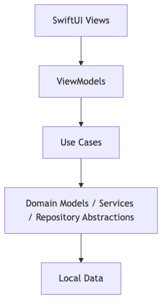
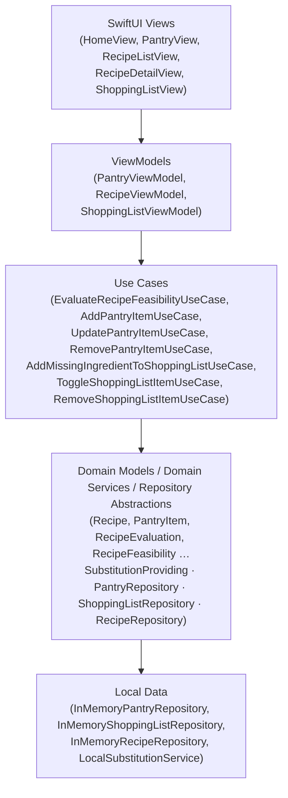
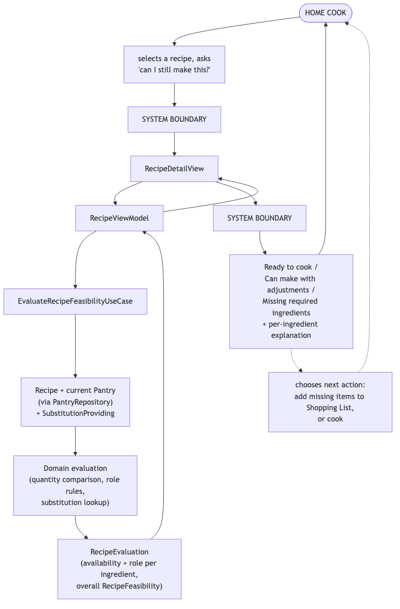
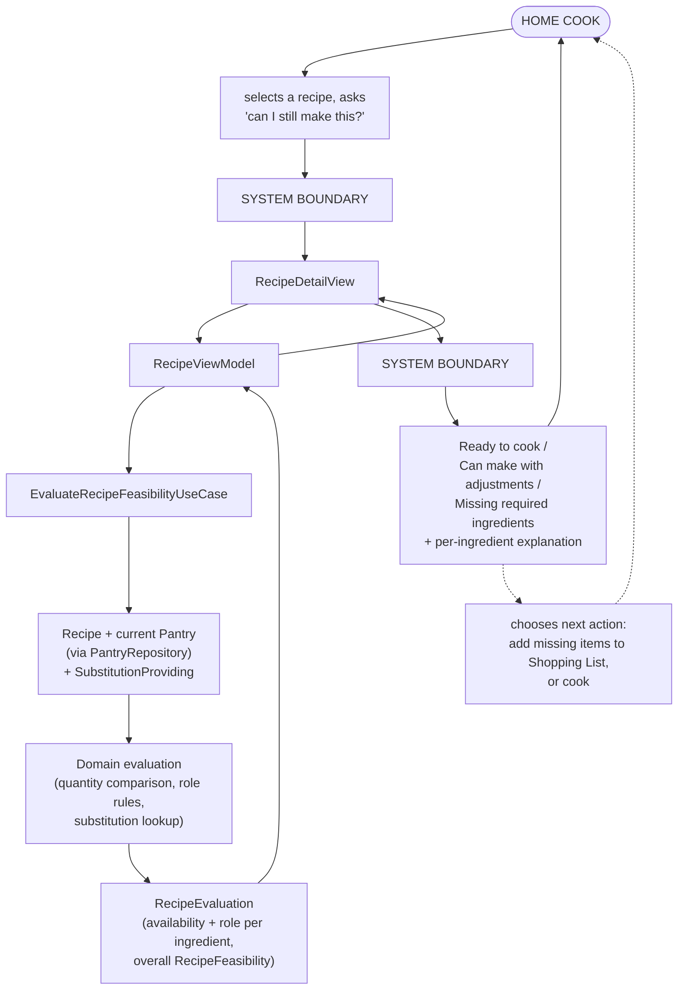

# PantryProof - Human-System Architecture Diagram

This is a one-page view of how PantryProof is layered, and how a single
end-to-end interaction - the home cook asking "can I still make this?" -
crosses that layering from a human action to a human-readable answer.

## Layer Structure

Mermaid source

Business rules live only in the **Use Cases** and **Domain** layers. Views
render state and forward intent; ViewModels hold presentation state and
call use cases, never computing feasibility, validation, or duplicate
rules themselves.

## Human-System Boundary: "Can I still make this?"

Mermaid source

The same `RecipeEvaluation` produced by the use case is what the view
renders - there is no second, independent place where feasibility could be
recomputed differently. If the cook chooses to add a missing ingredient to
the shopping list, that action re-enters the same pattern one layer down:
`RecipeDetailView → ShoppingListViewModel → AddMissingIngredientToShoppingListUseCase → ShoppingListRepository`.

## Rendering this diagram

Both diagrams above are valid [Mermaid](https://mermaid.js.org) syntax and
render natively in GitHub's Markdown preview, in most Markdown-aware
editors, and in the Mermaid Live Editor (https://mermaid.live) for
exporting to PNG/PDF/SVG if a static image is needed for a slide deck or
printed report.
